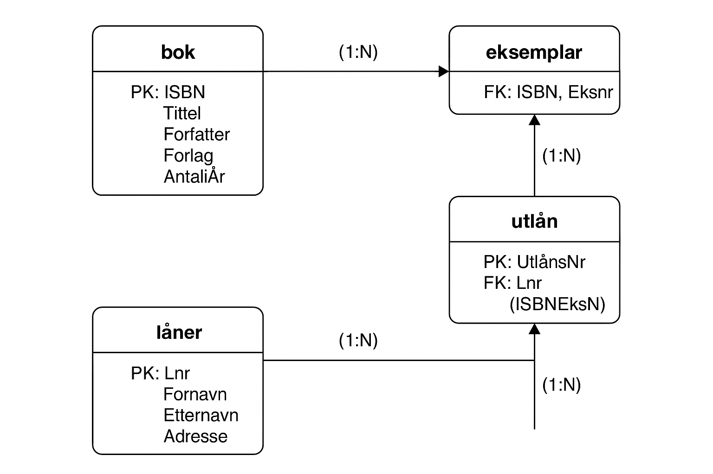

# 📘 Explanation of the Database Design (ga_bibliotek)

This database is created to manage a small library system.  
It keeps track of books, copies of those books, people who borrow them, and each loan transaction.  
The goal is to maintain accurate and consistent information using **primary keys**, **foreign keys**, and **constraints**.

---

## 1. Database Overview

The database contains four main tables:

| Table | Purpose |
|--------|----------|
| bok | Stores general information about books. |
| eksemplar | Stores physical copies of each book. |
| låner | Stores information about borrowers. |
| utlån | Stores details about each borrowing transaction. |

These tables are connected through **foreign keys** to ensure data integrity.

---

## 2. Table Descriptions

### bok

Contains information about each book.

| Column | Datatype | Description |
|---------|-----------|-------------|
| ISBN | VARCHAR(20) | Primary key. Unique identifier for each book. |
| Tittel | VARCHAR(255) | Title of the book. |
| Forfatter | VARCHAR(100) | Name of the author. |
| Forlag | VARCHAR(100) | Publisher of the book. |
| UtgittÅr | SMALLINT UNSIGNED | Year of publication. |
| AntallSider | INT | Number of pages. Must be greater than 0. |

**Constraints used:**
- `PRIMARY KEY (ISBN)` — ensures each book is unique.  
- `NOT NULL` — required fields cannot be empty.  
- `CHECK (AntallSider > 0)` — prevents invalid page counts.

---

### eksemplar

Contains physical copies of books.

| Column | Datatype | Description |
|---------|-----------|-------------|
| ISBN | VARCHAR(20) | Foreign key referencing `bok(ISBN)`. |
| EksNr | INT | Copy number for each book. |

**Constraints used:**
- `PRIMARY KEY (ISBN, EksNr)` — combination of ISBN and copy number is unique.  
- `FOREIGN KEY (ISBN)` REFERENCES `bok(ISBN)`  
  → Keeps the copy linked to an existing book.  
- `ON UPDATE CASCADE` — if a book’s ISBN changes, copies are updated automatically.  
- `ON DELETE RESTRICT` — prevents deletion of a book if copies exist.

---

### låner

Stores information about people who borrow books.

| Column | Datatype | Description |
|---------|-----------|-------------|
| LNr | INT | Primary key. Auto-incremented borrower ID. |
| Fornavn | VARCHAR(50) | First name. |
| Etternavn | VARCHAR(50) | Last name. |
| Adresse | VARCHAR(255) | Full address. |

**Constraints used:**
- `PRIMARY KEY (LNr)` — unique ID for each borrower.  
- `AUTO_INCREMENT` — automatically generates a new borrower number.

---

### utlån

Stores details of each loan transaction.

| Column | Datatype | Description |
|---------|-----------|-------------|
| UtlånsNr | INT | Primary key. Auto-incremented loan number. |
| LNr | INT | Foreign key referencing `låner(LNr)`. |
| ISBN | VARCHAR(20) | Part of foreign key linking to book copy. |
| EksNr | INT | Part of foreign key linking to book copy. |
| Utlånsdato | DATE | The date when the book was borrowed. |
| Levert | TINYINT(1) | Indicates if the book has been returned (0 = not returned, 1 = returned). |

**Constraints used:**
- `PRIMARY KEY (UtlånsNr)` — ensures each loan is unique.  
- `FOREIGN KEY (LNr)` REFERENCES `låner(LNr)` — connects each loan to a valid borrower.  
- `FOREIGN KEY (ISBN, EksNr)` REFERENCES `eksemplar(ISBN, EksNr)` — connects the loan to a specific book copy.  
- `CHECK (Levert IN (0,1))` — ensures the return status is either 0 or 1.  
- `ON UPDATE CASCADE` — keeps data consistent when related records change.  
- `ON DELETE RESTRICT` — prevents deleting a borrower or book copy that’s still in use.

---

## 3. Relationships Between Tables

| Relationship | Type | Description |
|---------------|------|-------------|
| bok → eksemplar | One-to-Many (1:N) | One book can have multiple copies. |
| eksemplar → utlån | One-to-Many (1:N) | Each book copy can be borrowed many times. |
| låner → utlån | One-to-Many (1:N) | Each borrower can have many loans. |

**Foreign keys maintain referential integrity** so that all records remain valid and consistent.

---

## 4. Data Integrity and Constraints

The database uses constraints to ensure valid and reliable data.

| Constraint | Purpose |
|-------------|----------|
| PRIMARY KEY | Ensures each record is unique. |
| FOREIGN KEY | Keeps links between tables valid. |
| NOT NULL | Prevents missing required information. |
| CHECK | Validates values (for example, only 0 or 1 for `Levert`). |
| ON UPDATE CASCADE | Updates related records automatically when keys change. |
| ON DELETE RESTRICT | Prevents deletion of data that other records depend on. |

---

## 5. Example Data and Queries

Example data is inserted into each table to demonstrate how the database works.

**Example Insert:**
```sql
INSERT INTO bok (ISBN, Tittel, Forfatter, Forlag, UtgittÅr, AntallSider)
VALUES ('8203188843','Kristin Lavransdatter: Kransen','Undset, Sigrid','Aschehoug',1920,323);

**Purpose:**  
Shows who borrowed which book, including title, borrower name, and return status.

---

## 6. ER Diagram



### Diagram Explanation
- Each box represents a table.  
- **PK** = Primary Key, **FK** = Foreign Key.  
- The arrows represent relationships between the tables.  
- **(1:N)** means “one-to-many” — one record in the first table can link to several in the second.

---

## 7. Summary

This database:
- Organizes book and borrower data efficiently.  
- Keeps all relationships valid through **foreign keys**.  
- Uses **constraints** to ensure clean, consistent, and correct data.  
- Can easily produce useful reports — such as which books are most borrowed, who borrowed them, and whether they have been returned.
